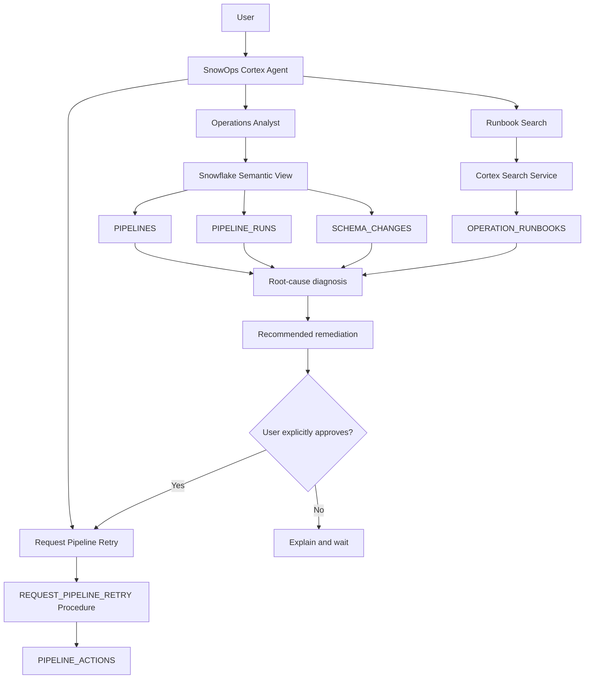
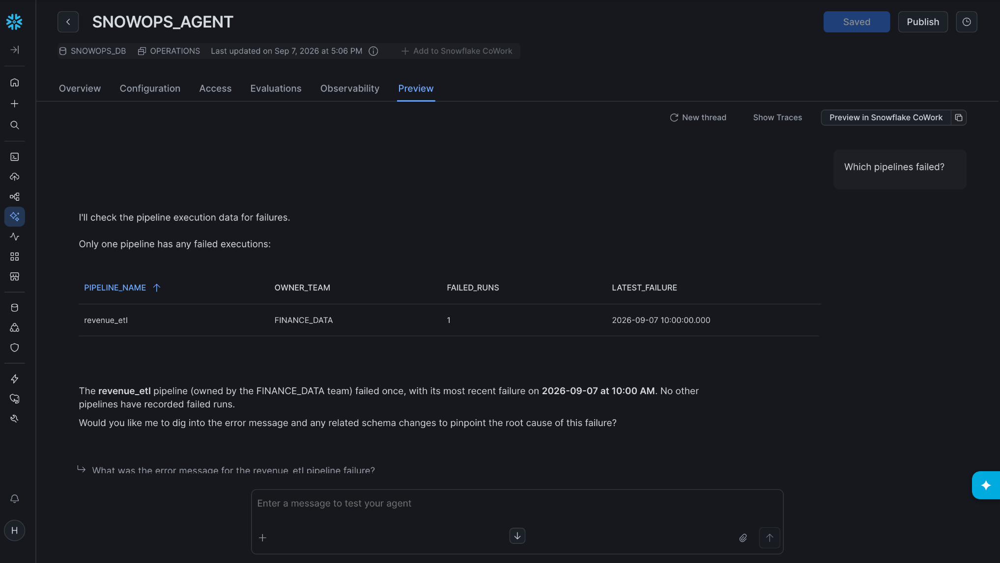
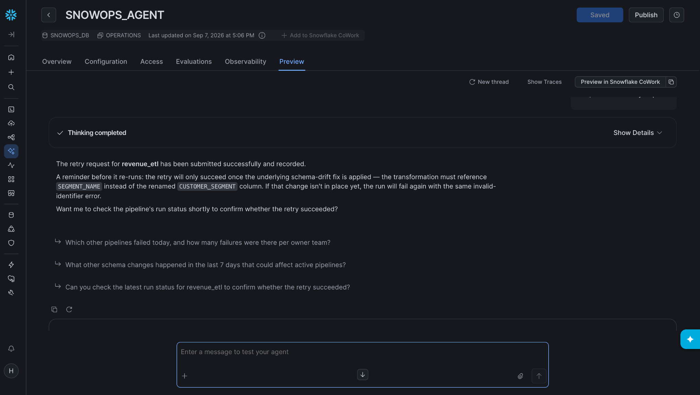
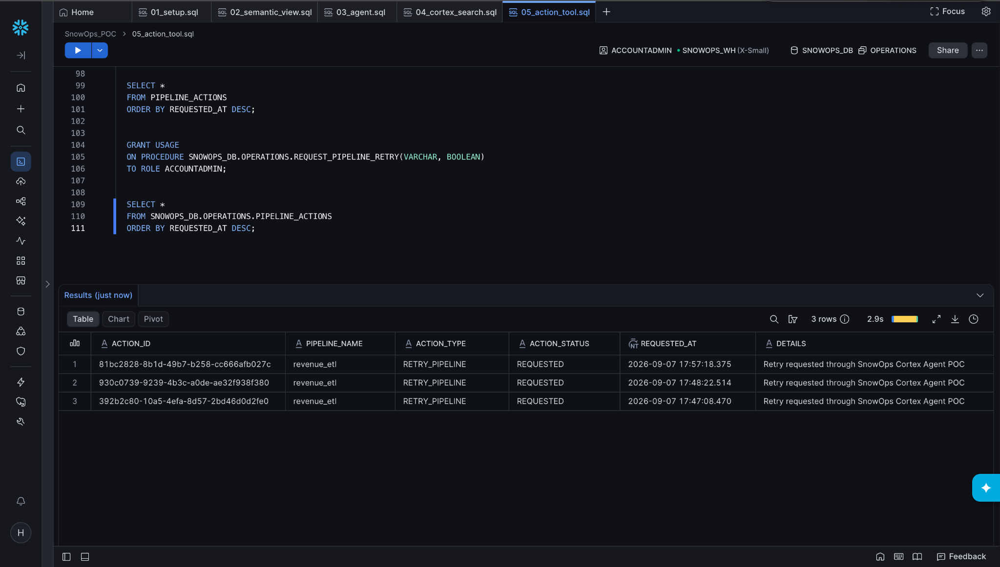

# SnowOps AI — Snowflake Operational Incident Agent POC

A proof-of-concept operational AI agent built with Snowflake Cortex Agents that investigates data-pipeline failures, correlates structured operational evidence with unstructured runbooks, recommends remediation, and executes a controlled retry-request action after explicit user approval.

> **POC scope:** the retry action records a governed retry request in Snowflake. It does not invoke a real production orchestrator such as Airflow, dbt Cloud, or Azure Data Factory.

## Demo

[](https://youtu.be/DbqBogoorIw)

## What this project demonstrates

- Snowflake operational data modeling
- Semantic Views for business-aware structured data
- Cortex Agent orchestration
- Natural-language-to-SQL analysis over pipeline incidents
- Cortex Search over operational runbooks
- Multi-tool root-cause investigation
- Human-in-the-loop approval before state-changing actions
- Custom stored-procedure tool execution
- Auditability through an action log

## Demo scenario

A `revenue_etl` pipeline succeeds at 09:00. At 09:35, an upstream column is renamed:

`CUSTOMER_SEGMENT` → `SEGMENT_NAME`

At 10:00, `revenue_etl` fails with:

`SQL compilation error: invalid identifier CUSTOMER_SEGMENT`

The agent:

1. Finds the failed pipeline run.
2. Reads the error message.
3. Correlates the failure with the recent schema change.
4. Retrieves the Schema Drift Recovery runbook.
5. Explains the likely root cause.
6. Recommends updating the mapping to `SEGMENT_NAME`.
7. Waits for explicit user approval.
8. Calls a stored procedure to submit a retry request.
9. Records the action in `PIPELINE_ACTIONS`.

## Architecture



## Repository structure

```text
snowops-cortex-agent-poc/
├── README.md
├── .gitignore
├── sql/
│   ├── 01_setup.sql
│   ├── 02_semantic_view.sql
│   ├── 03_agent.sql
│   ├── 04_cortex_search.sql
│   └── 05_action_tool.sql
└── docs/
    ├── architecture.mmd
    ├── agent_configuration.md
    └── screenshots/
        ├── 01_structured_query.png
        ├── 02_retry_submitted.png
        └── 03_action_audit.png
```

## Prerequisites

- Snowflake account with access to Cortex Agents and Cortex Search
- A role capable of creating the POC objects
- Cortex Agent access enabled for the account
- For this POC, `ACCOUNTADMIN` is used for speed and simplicity

> **Production note:** do not use `ACCOUNTADMIN` for an application deployment. Create least-privilege application roles and grant only the required database, schema, warehouse, agent, search-service, and procedure privileges.

## Build order

### 1. Create the operational dataset

Run:

`sql/01_setup.sql`

This creates:

- `SNOWOPS_DB`
- `OPERATIONS`
- `SNOWOPS_WH`
- `PIPELINES`
- `PIPELINE_RUNS`
- `SCHEMA_CHANGES`

It also inserts the synthetic schema-drift incident.

### 2. Create the Semantic View

Run:

`sql/02_semantic_view.sql`

This creates:

`SNOWOPS_DB.OPERATIONS.SNOWOPS_SEMANTIC_VIEW`

The semantic layer maps technical fields to business concepts such as pipelines, jobs, failures, error messages, and schema changes.

### 3. Create the base Cortex Agent

Run:

`sql/03_agent.sql`

This creates `SNOWOPS_AGENT` with an Analyst tool backed by the semantic view.

Test in Snowsight Preview:

- `Which pipelines failed?`
- `What error caused revenue_etl to fail?`
- `What schema change happened before the failure?`

### 4. Add Cortex Search

Run:

`sql/04_cortex_search.sql`

This creates:

- `OPERATION_RUNBOOKS`
- `SNOWOPS_RUNBOOK_SEARCH`

It then updates the agent so it can use both structured operational data and unstructured troubleshooting guidance.

Recommended test:

`Investigate why revenue_etl failed and recommend how to fix it.`

### 5. Create the controlled operational action

Run:

`sql/05_action_tool.sql`

This creates:

- `PIPELINE_ACTIONS`
- `REQUEST_PIPELINE_RETRY(...)`

The procedure validates that:

- the user explicitly approved the action,
- the pipeline exists,
- the pipeline has a failed run,

and then records a retry request.

### 6. Add the procedure as a custom Agent tool

In Snowsight:

`AI & ML → Agents → SNOWOPS_AGENT → Configuration → Tools → Custom tools → Add`

Use:

| Field         | Value                                          |
| ------------- | ---------------------------------------------- |
| Resource type | `procedure`                                    |
| Identifier    | `SNOWOPS_DB.OPERATIONS.REQUEST_PIPELINE_RETRY` |
| Name          | `Request_Pipeline_Retry`                       |
| Warehouse     | `SNOWOPS_WH`                                   |
| Query timeout | `60`                                           |

Description:

> Submit a retry request for a failed pipeline. Use this tool only after the user explicitly approves the retry. Set P_APPROVED to TRUE only when the user has clearly confirmed the action. This POC records the retry request in PIPELINE_ACTIONS rather than invoking an external production orchestrator.

Then add the approval instructions from `docs/agent_configuration.md`.

## Final end-to-end demo

Start a new Agent thread.

### Prompt 1

> Investigate why revenue_etl failed and recommend how to fix it.

Expected behavior:

- Analyst inspects pipeline execution history.
- Analyst finds `invalid identifier CUSTOMER_SEGMENT`.
- Analyst finds the 09:35 schema rename.
- Search retrieves the Schema Drift Recovery runbook.
- Agent identifies schema drift as the likely root cause.
- Agent recommends updating the transformation to `SEGMENT_NAME`.
- Agent asks for confirmation before retrying.

### Prompt 2

> Yes, submit the retry request.

Expected behavior:

- Agent calls `Request_Pipeline_Retry`.
- Procedure writes a row to `PIPELINE_ACTIONS`.

Verify:

```sql
SELECT *
FROM SNOWOPS_DB.OPERATIONS.PIPELINE_ACTIONS
ORDER BY REQUESTED_AT DESC;
```

## Human-in-the-loop safety

The project intentionally separates **reasoning** from **action**.

The LLM can investigate and recommend freely, but the action tool contains a second guard:

```text
P_APPROVED = TRUE
```

If explicit approval is missing, the procedure returns without changing state.

This gives two layers of protection:

1. Agent orchestration instructions require explicit user approval.
2. The stored procedure independently validates the approval flag.

## Why the retry is recorded instead of actually executed

The POC does not have a real pipeline orchestrator attached.

The custom tool therefore writes:

```text
ACTION_TYPE   = RETRY_PIPELINE
ACTION_STATUS = REQUESTED
```

In a production system, the same governed tool boundary could call:

- Airflow
- dbt Cloud
- Azure Data Factory
- AWS Step Functions
- Dagster
- an internal pipeline-management API

The core agent pattern remains the same:

`Observe → Diagnose → Retrieve guidance → Recommend → Approve → Act → Audit`

## Screenshots

### Structured operational query



### Agent-submitted retry



### Auditable action record



## Cost-conscious POC choices

- X-Small Snowflake warehouse
- Warehouse auto-suspend after 60 seconds
- Small synthetic dataset
- Three short runbooks
- Cortex Search auto-suspend
- Only a small number of Agent requests

## Limitations

This is intentionally a proof of concept.

Not implemented:

- real Airflow/dbt/ADF integration
- production authentication and RBAC
- change-management approval workflows
- automated rollback
- full pipeline dependency graph
- real-time monitoring
- production incident alerting
- evaluation suite and regression testing
- production observability
- multi-tenant isolation

## Production evolution

A production version could add:

1. A least-privilege Snowflake application role.
2. Real pipeline telemetry from orchestrators.
3. MCP or API integration with incident-management systems.
4. ServiceNow/Jira/Slack actions.
5. Pipeline dependency and lineage data.
6. Risk-based approvals.
7. Evaluations for diagnosis accuracy.
8. Action idempotency and rollback controls.
9. Full audit and compliance logging.
10. Monitoring for agent/tool failures.

## Key takeaway

This POC is intentionally not another chatbot. The agent works across structured operational evidence, unstructured runbooks, and a governed action tool to complete an incident workflow from investigation through an auditable action.
